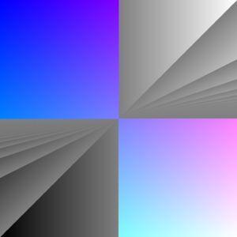
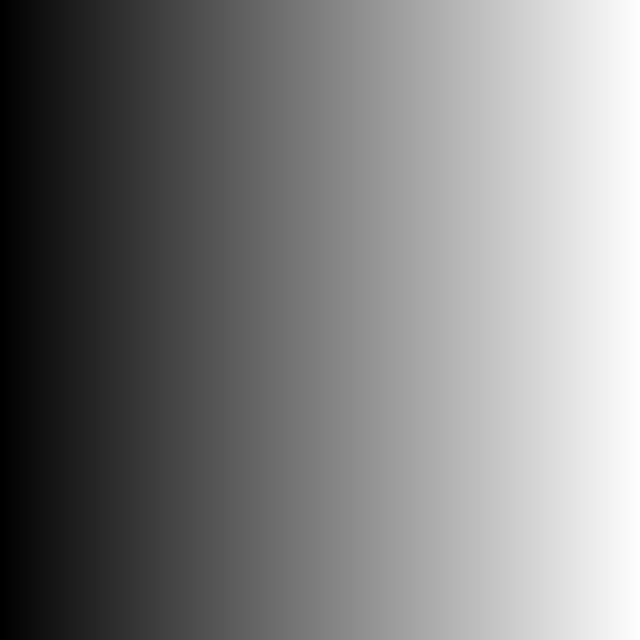
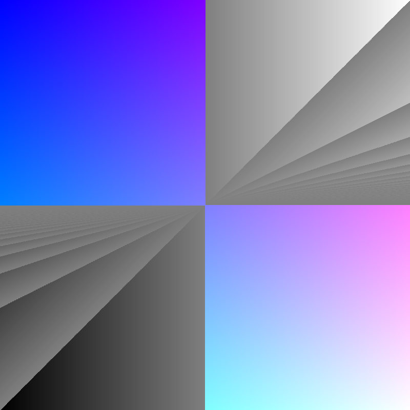

<div align="center">
<h1>hashvis</h1>

samarth kulshrestha


<br/><br/><br/>

<br/><br>
</div>

## introduction

**hashvis** is a random art implementation based on **hash visualisation**
(Perrig and Song, 1999). [the paper](https://netsec.ethz.ch/publications/papers/validation.pdf)
focuses on implementing methods of making visual validation of root keys
in public-key infrastructures. at this point, this project implements the
[random art](https://www.random-art.org/) part of the paper, where an [abstract
syntax tree](https://en.wikipedia.org/wiki/Abstract_syntax_tree) is randomly
generated based on a predefined grammar. the AST, which forms a function, is
then used to generate visual art.

## usage

+ clone git repository
```console
git clone https://github.com/samarthkulshrestha/hashvis.git
```

+ compile the build system
```console
cc -o nob nob.c
```

+ run
```console
./nob
```

+ feel free to play around with the `HEIGHT` and `WIDTH` constants to changed
the resolution of the rendered image. the `depth` parameter in `gen_rule()`
function is also interesting to play around with.

## demos

+ the following images' functions are described in the paper.




+ the following images have been randomly generated.


## references

+ Perrig, A. and Song, D. (1999)
['Hash Visualization: a New Technique to improve Real-World Security'](https://netsec.ethz.ch/publications/papers/validation.pdf)

## contribute

 [](https://makeapullrequest.com)
 [](https://cs50.readthedocs.io/style/c/)

+ i <3 pull requests and bug reports!
+ don't hesitate to [tell me my code-fu sucks](https://github.com/samarthkulshrestha/hashvis/issues/new), but please tell me why.

## license

hashvis is licensed under the MIT License.

Copyright (c) 2024 Samarth Kulshrestha.
